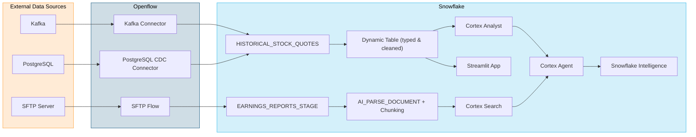

# Openflow Financial Services Workshop

A hands-on workshop demonstrating how to integrate structured and unstructured data sources into Snowflake using Openflow, build Cortex AI capabilities over that data, and deliver intelligent natural-language access through Snowflake Intelligence.

The workshop uses a financial services scenario with NASDAQ historical stock quotes (structured data) and quarterly earnings reports (unstructured data) for Microsoft and Tesla.

## Architecture

> **Phase 2 choice**: Choose either the Kafka streaming path or the PostgreSQL CDC path based on your use case. Both deliver the same structured data into Snowflake.

## Workshop Phases

| Phase | Title | Guide | Est. Time |
|-------|-------|-------|-----------|
| 0 | Prerequisites & Setup | [docs/phase-0-prerequisites.md](docs/phase-0-prerequisites.md) | 15 min |
| 1 | Deploy Infrastructure | [docs/phase-1-deploy-infrastructure.md](docs/phase-1-deploy-infrastructure.md) | 20-45 min |
| 2 | Structured Data | [docs/phase-2-structured-data.md](docs/phase-2-structured-data.md) | 20 min |
| 3 | Unstructured Data | [docs/phase-3-unstructured-data.md](docs/phase-3-unstructured-data.md) | 15 min |
| 4 | Cortex AI | [docs/phase-4-cortex-ai.md](docs/phase-4-cortex-ai.md) | 30 min |
| 5 | Cortex Agent | [docs/phase-5-cortex-agent.md](docs/phase-5-cortex-agent.md) | 15 min |
| 6 | Snowflake Intelligence | [docs/phase-6-snowflake-intelligence.md](docs/phase-6-snowflake-intelligence.md) | 15 min |
| 7 | Teardown & Cleanup | [docs/phase-7-teardown.md](docs/phase-7-teardown.md) | 10 min |

**Total estimated working time: ~3 hours** (half-day session with breaks)
