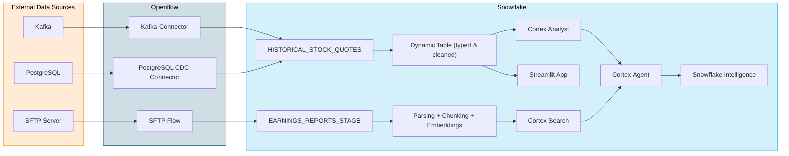

# Openflow Financial Services Workshop

A hands-on workshop demonstrating how to integrate structured and unstructured data sources into Snowflake using Openflow, build Cortex AI capabilities over that data, and deliver intelligent natural-language access through Snowflake Intelligence.

The payoff: a natural-language agent that can answer questions spanning both quantitative market data and qualitative financial narratives -- all from a single platform.

The workshop uses a financial services scenario with NASDAQ historical stock quotes (structured data) and quarterly earnings reports (unstructured data). The examples use Tesla (TSLA) throughout, but this can easily be replaced with stocks of your choice.

## Architecture

```mermaid
flowchart LR
    subgraph sources["External Data Sources"]
        direction TB
        kafka["Kafka"]
        cdc["PostgreSQL"]
        sftp["SFTP Server"]
    end

    subgraph openflow["Openflow"]
        direction TB
        kconn["Kafka Connector"]
        cdcconn["PostgreSQL CDC Connector"]
        sftppipe["SFTP Flow"]
    end

    subgraph snowflake["Snowflake"]
        direction TB
        table["HISTORICAL_STOCK_QUOTES"]
        stage["EARNINGS_REPORTS_STAGE"]
        dt["Dynamic Table (typed & cleaned)"]
        parse["Parsing + Chunking + Embeddings"]
        analyst["Cortex Analyst"]
        search["Cortex Search"]
        agent["Cortex Agent"]
        intel["Snowflake Intelligence"]
        streamlit["Streamlit App"]
    end

    kafka --> kconn
    cdc --> cdcconn
    sftp --> sftppipe

    kconn --> table
    cdcconn --> table
    sftppipe --> stage

    table --> dt
    stage --> parse

    dt --> analyst
    parse --> search

    analyst --> agent
    search --> agent
    agent --> intel

    dt --> streamlit

    style sources fill:#FFEBD6,stroke:#FF9F36,color:#000000
    style openflow fill:#CFDDE5,stroke:#11567F,color:#000000
    style snowflake fill:#D4F0FA,stroke:#29B5E8,color:#000000
```

> **Phase 2 choice**: Choose either the Kafka streaming path or the PostgreSQL CDC path based on your use case. Both deliver the same structured data into Snowflake.

## Workshop Phases

| Phase | Title | Guide | Est. Time |
|-------|-------|-------|-----------|
| 0 | Prerequisites & Setup | [docs/phase-0-prerequisites.md](docs/phase-0-prerequisites.md) | 15 min |
| 1 | Deploy Infrastructure | [docs/phase-1-deploy-infrastructure.md](docs/phase-1-deploy-infrastructure.md) | 20-45 min |
| 2A | Structured Data (Kafka) | [docs/phase-2a-structured-kafka.md](docs/phase-2a-structured-kafka.md) | 20 min |
| 2B | Structured Data (PostgreSQL CDC) | [docs/phase-2b-structured-postgresql.md](docs/phase-2b-structured-postgresql.md) | 20 min |
| 3 | Streamlit Dashboard | [docs/phase-3-streamlit-dashboard.md](docs/phase-3-streamlit-dashboard.md) | 10 min |
| 4 | Unstructured Data | [docs/phase-4-unstructured-data.md](docs/phase-4-unstructured-data.md) | 15 min |
| 5 | Cortex AI | [docs/phase-5-cortex-ai.md](docs/phase-5-cortex-ai.md) | 30 min |
| 6 | Cortex Agent | [docs/phase-6-cortex-agent.md](docs/phase-6-cortex-agent.md) | 15 min |
| 7 | Snowflake Intelligence | [docs/phase-7-snowflake-intelligence.md](docs/phase-7-snowflake-intelligence.md) | 15 min |
| 8 | Teardown & Cleanup | [docs/phase-8-teardown.md](docs/phase-8-teardown.md) | 10 min |

**Total estimated working time: ~3 hours** (half-day session with breaks)
